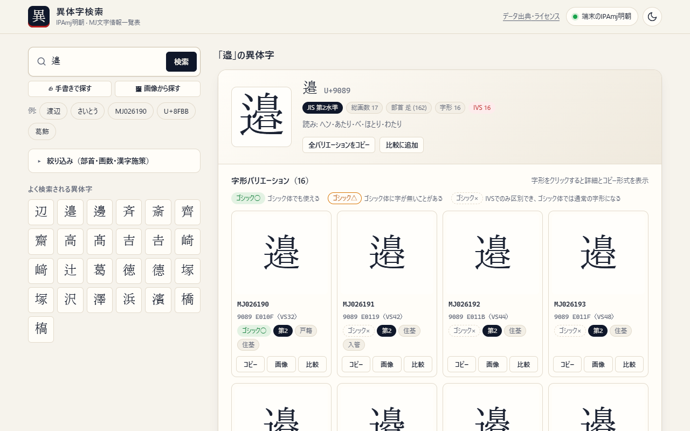
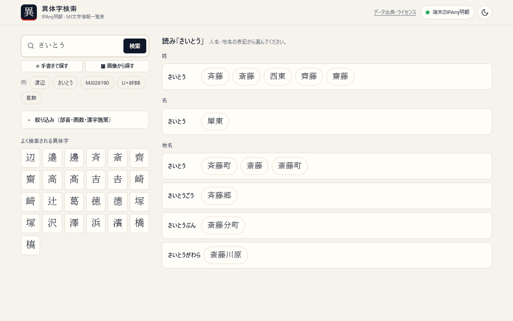
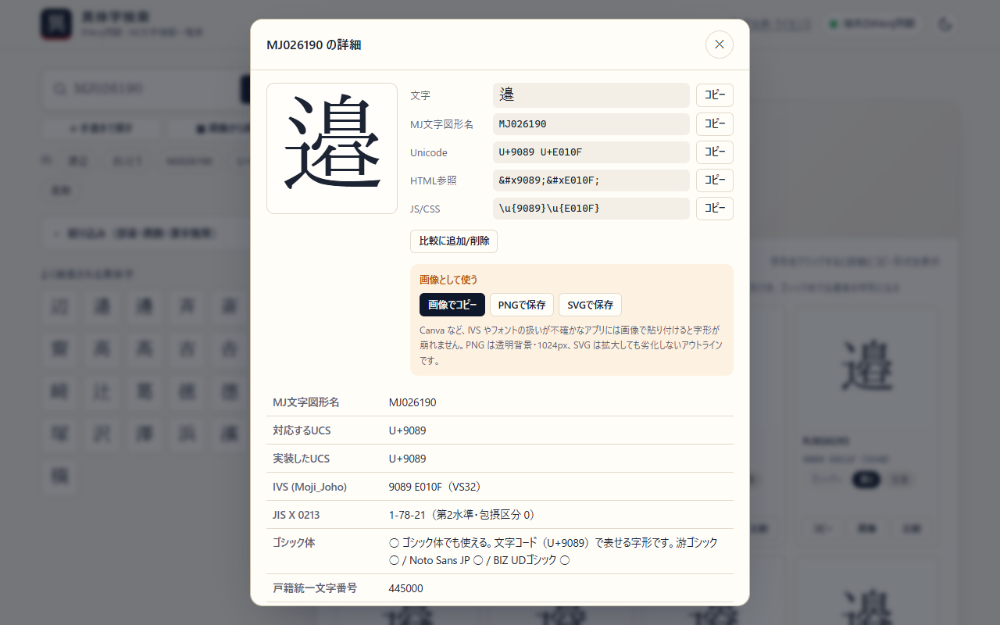
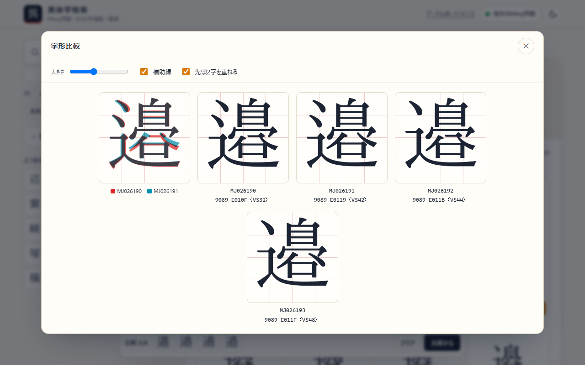

# MJ Variant Finder（IPAmj明朝 異体字検索）

**IPAmj明朝の異体字（IVS）を、フォントを入れなくてもブラウザだけで検索・比較・コピー・画像化できる静的Webツールです。**
サーバー処理も外部APIも不要で、静的ファイルを置くだけで動きます。

> 🌐 **デモ**: https://photoguild-itteam.github.io/mj-variant-finder/



## 何ができるか

「邉」と「邊」、「髙」と「高」のような**字形の違い**を、コードの違い（Unicode・IVS）ごと確認できます。戸籍・住基・入管など、文字の違いが問題になる業務で、どの字形を使うべきかを調べる用途を想定しています。

- **検索**: 文字・単語（1文字ずつ展開）、読み（ひらがな。人名・地名の辞書つき）、MJ文字図形名（`MJ026190`）、コードポイント（`U+8FBB`、`9089_E010F`、HTML参照）、部首・画数・漢字施策での絞り込み
- **異体字の関係**: 同じ文字コード内の IVS 異体字と、文字コードが異なる新旧字体・俗字（辺・邉・邊 など）を、MJ縮退マップをもとに一覧
- **詳細情報**: MJ文字図形名、IVS、JIS水準、戸籍統一文字番号、住基ネット統一文字コード、入管コード、漢字施策、読み、画数、部首 など
- **ワンクリックコピー**: IVS付きの文字、MJ番号、`U+9089 U+E010F`、HTML数値参照、JS/CSS エスケープ
- **画像・ベクター書き出し**: 透明PNG（クリップボードへコピー可）、SVGアウトライン。IVS やフォントの扱いが不確かなアプリ（Canva など）に、字形を崩さず持ち込めます
- **Webフォント表示**: IPAmj明朝の派生フォント（79ファイル、`unicode-range` で必要な分だけ読み込み）。フォント未導入の環境でも IVS を正しく表示
- **比較**: 複数の字形を並べる／重ねて（赤・青）、細かな差分を確認
- **ゴシック体の判定**: その字形がゴシック体でも使えるか（○/△/×）を表示
- **手書きで探す**: 枠に書いた字から候補を出す（KanjiVG、6,702字）
- **画像から探す**: スクリーンショットを貼り付け、1文字を囲むと、IPAmj明朝の全 58,843 字形と照合（同じ IPAmj明朝の表示なら 1位 90% / 上位10 98%）
- ダーク/ライトモード、スマホ対応、URL（`#q=渡辺`）での共有

| 読み検索 | 字形の詳細 | 比較 |
|---|---|---|
|  |  |  |

## ⚠️ 免責事項

**本ツールは公的機関のデータを機械処理したものであり、字形の同一性・正確性を保証するものではありません。印刷や公的申請への利用は利用者の自己責任で行ってください。**

- 本プロジェクトは、MJ文字情報一覧表・IPAmj明朝の提供元（文字情報技術促進協議会・情報処理推進機構）とは**無関係の非公式のツール**です
- 「異体字に置き換えた表記」（人名・地名の読み検索）は機械的に作ったもので、実在の確認はしていません
- 手書き・画像からの認識は候補を出すもので、結果の正しさは保証しません
- 本ソフトウェアは MIT ライセンスのもと**現状のまま**提供され、サポート（SLA）はありません。**個別の文字の調査・解釈のご相談にはお応えできません**

## 使い方

### オンラインで使う

デモサイトを開くだけです。検索語は URL の `#q=` に入るので、リンクで共有できます。

### ローカルで動かす

```sh
git clone https://github.com/photoguild-ITteam/mj-variant-finder.git
cd mj-variant-finder
npm run serve            # = python -m http.server 8765 → http://127.0.0.1:8765/
```

ES Modules と fetch を使うので、`file://` では動きません（HTTPサーバー経由で開いてください）。ビルド済みのデータとフォントを含んでいるので、追加のセットアップは要りません（Python 3 があれば動きます）。

### 自分のサイトに置く

`index.html` と `src/` を、任意の静的ホスティングに置くだけです（GitHub Pages、Netlify、S3 など）。**`LICENSE`・`LICENSES.md`・`licenses/` も一緒に置いてください**（画面からリンクしており、データのライセンスの条件でもあります。→ [ライセンス](#ライセンス)）。相対パスなので、サブパスに置いても動きます。認証付きのサーバーの後ろに置く場合は、`src/js/config.js` の `sessionWatch` を設定すると、ログイン切れの案内を出せます。

## 開発

```sh
npm install              # 開発用（テスト・ビルド）。実行には不要
npm test                 # 単体テスト（Node）+ データ検証（Python unittest）
npm run test:e2e         # ブラウザテスト（Playwright。要 Chrome、`npm run serve` を起動しておく）
```

データやフォントを作り直す手順、各機能の仕組みは [docs/ARCHITECTURE.md](docs/ARCHITECTURE.md) にあります。
元データ（MJ文字情報一覧表など）は公式配布元から取得するもので、リポジトリには含めません（`data/raw/`、Git 管理外）。

MJ文字情報や Unicode の改訂があったときは、`npm run build:data` などのスクリプトを再実行して差分をコミットします。

### コントリビューション

Issue・Pull Request を歓迎します（[CONTRIBUTING.md](CONTRIBUTING.md)）。セキュリティ上の問題は [SECURITY.md](SECURITY.md) をご覧ください。

## ライセンス

このリポジトリは**複合ライセンス**です。プログラムは当社が書いたもので MIT ライセンスですが、文字データとフォントは公的機関やほかのプロジェクトの成果物を加工したもので、**元のライセンスをそれぞれ引き継いでいます。`src/data/`・`src/fonts/`・`src/vendor/` は MIT ではありません。**

> ここに書いたのは各ライセンスの一般的な読み方で、法的な助言ではありません。判断に迷う使い方をするときは、条文の原文を確認し、必要に応じて専門家に相談してください。

### 何がどのライセンスか

| 部分 | ファイル | ライセンス | 著作権者・出典 |
|---|---|---|---|
| プログラム・ドキュメント | `index.html`, `src/js/`, `src/css/`, `scripts/`, `tests/`, `*.md` | [MIT](LICENSE) | 株式会社フォトギルド |
| 異体字データ | `src/data/chars/`, `src/data/search-index.json`, `src/data/meta.json` | [CC BY-SA 2.1 JP](https://creativecommons.org/licenses/by-sa/2.1/jp/) ＋ [Unicode License v3](licenses/UNICODE-LICENSE.txt) | 文字情報技術促進協議会（MJ文字情報一覧表）、情報処理推進機構（MJ縮退マップ）、Unicode, Inc.（IVD・Unihan） |
| 手書き認識データ | `src/data/handwriting-patterns.json` | [CC BY-SA 3.0](https://creativecommons.org/licenses/by-sa/3.0/) | Ulrich Apel（[KanjiVG](https://kanjivg.tagaini.net/)） |
| 人名・地名の辞書 | `src/data/names.json` | [ipadic ライセンス](licenses/IPADIC-COPYING.txt) | 奈良先端科学技術大学院大学（mecab-ipadic）、日本郵便（郵便番号データ。著作権を主張していない） |
| Webフォント | `src/fonts/` | [IPAフォントライセンス v1.0](src/fonts/LICENSE_IPA_Font_v1.0.txt) | 情報処理推進機構（IPAmj明朝）。名称を「MJ Variant Mincho」に変えた派生フォント |
| 画像検索のデータ | `src/data/image-index.*` | IPAフォントライセンス v1.0 | IPAmj明朝で描いた字形から計算した特徴量（フォントそのものではない） |
| 同梱ライブラリ | `src/vendor/` | [MIT](src/vendor/kanji-canvas.LICENSE.txt)・[Apache-2.0・0BSD ほか](src/vendor/THIRD_PARTY_LICENSES.txt) | Kanji Canvas、fontkit と依存パッケージ |
| 説明用の画面写真 | `docs/images/` | CC BY-SA 2.1 JP | 画面に MJ文字情報一覧表のデータを含むため |

ファイル単位の対応は [LICENSES.md](LICENSES.md) に、表示が条件になっている条文の原文は [licenses/](licenses/) と [src/fonts/LICENSE_IPA_Font_v1.0.txt](src/fonts/LICENSE_IPA_Font_v1.0.txt) にあります。

### 使い方ごとに必要なこと

**どのライセンスも商用利用を認めています。** 必要なことは、何をするかで変わります。

| やりたいこと | 必要なこと |
|---|---|
| このツールをそのまま自社サイトや社内で動かす | `LICENSE`・`LICENSES.md`・`licenses/`・`src/fonts/LICENSE_IPA_Font_v1.0.txt` を消さずに一緒に置く。画面の「データ出典・ライセンス」も残す |
| プログラム（`src/js/` など）を自分のソフトに流用する | MIT: 著作権表示と許諾文（[LICENSE](LICENSE)）を残す |
| 異体字データを加工して配布する | CC BY-SA 2.1 JP: 出典（MJ文字情報一覧表など）を表示し、加工したことを明記し、加工後のデータも CC BY-SA 2.1 JP で配布する。IVD・Unihan 由来の部分には [Unicode License](licenses/UNICODE-LICENSE.txt) の条文を添える |
| 手書き認識データを加工して配布する | CC BY-SA 3.0: KanjiVG と Ulrich Apel の名前・リンクを表示し、CC BY-SA 3.0 で配布する |
| 人名・地名の辞書を配布する | [licenses/IPADIC-COPYING.txt](licenses/IPADIC-COPYING.txt) を必ず添える（加工した場合も。無保証の条項も省かない） |
| Webフォントを配布・改変する | IPAフォントライセンス第3条: フォント名・ファイル名に「IPAmj明朝」を使わない、ライセンス本文を添える、作り方とオリジナルへの置き換え方を提供する（[src/fonts/README.md](src/fonts/README.md) がその例） |
| 書き出した PNG・SVG や印刷物を使う | 自由に使えます（商用可）。IPAフォントライセンス第2条で、フォントを使って作った印刷物・画像などは用途を問わず利用・配布できるとされています |

### 注意点

- **CC BY-SA 2.1 JP と 3.0 のデータは混ぜられません。** どちらも「同じライセンスで配布すること」が条件で、両方を同時に満たすライセンスがないためです。異体字データと手書き認識データは、別々のファイルのまま扱ってください。
- **「同じライセンスで配布すること」（継承）がかかるのは、データファイルそのものと、それを加工したものだけです。** このツールのプログラムや、データを読み込むあなたのプログラムまで CC BY-SA にする必要はありません（プログラムとデータを別々の著作物として配布しているため）。
- **無保証です。** どのライセンスも無保証で、データの正確性は保証されません（[免責事項](#️-免責事項)）。
- **公式のツールではありません。** 「IPAmj明朝」「MJ文字情報一覧表」の名前は出典の説明として使っているだけで、提供元が推奨・保証しているものではありません。提供元の名前やロゴを、公式のように見える形で使わないでください。
- **商用フォントのデータは含みません。** ゴシック体の判定に使っているのは、Noto Sans JP と BIZ UDゴシック（どちらも SIL Open Font License）に字があるかどうかの情報だけで、フォント自体は同梱していません。
- **元データはリポジトリに含めていません。** ビルドに使う MJ文字情報一覧表などの元データ（`data/raw/`）は、スクリプトが公式の配布元から取得します。取得するときは、各配布元の利用条件に従ってください。

## 出典

- [MJ文字情報一覧表](https://moji.or.jp/mojikiban/mjlist/)・[IPAmj明朝](https://moji.or.jp/mojikiban/font/)（文字情報技術促進協議会）、[MJ縮退マップ](https://moji.or.jp/mojikiban/map/)（情報処理推進機構）
- [Unicode IVD](https://www.unicode.org/ivd/)・[Unihan](https://www.unicode.org/reports/tr38/)（Unicode, Inc.）
- [KanjiVG](https://kanjivg.tagaini.net/)（Copyright (C) 2009-2013 Ulrich Apel、CC BY-SA 3.0）・[Kanji Canvas](https://github.com/asdfjkl/kanjicanvas)（手書き認識）
- [mecab-ipadic](https://taku910.github.io/mecab/)・[郵便番号データ](https://www.post.japanpost.jp/zipcode/dl/utf-zip.html)（人名・地名の読み）

## クレジット

Developed by **株式会社フォトギルド** — https://photoguild.jp
