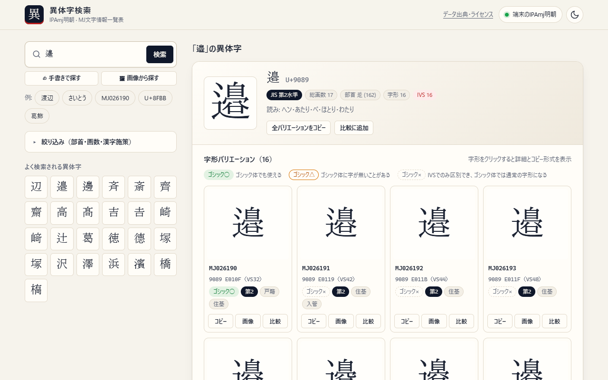
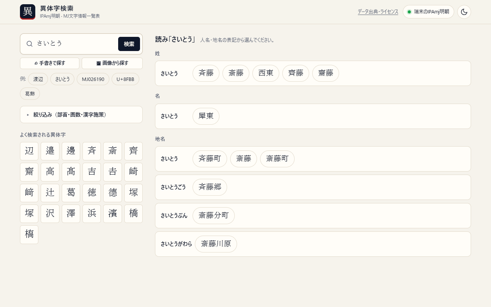
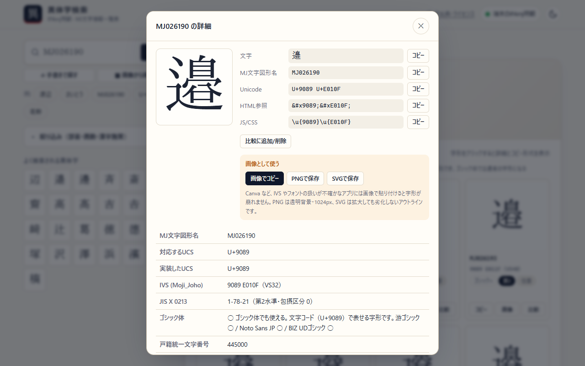
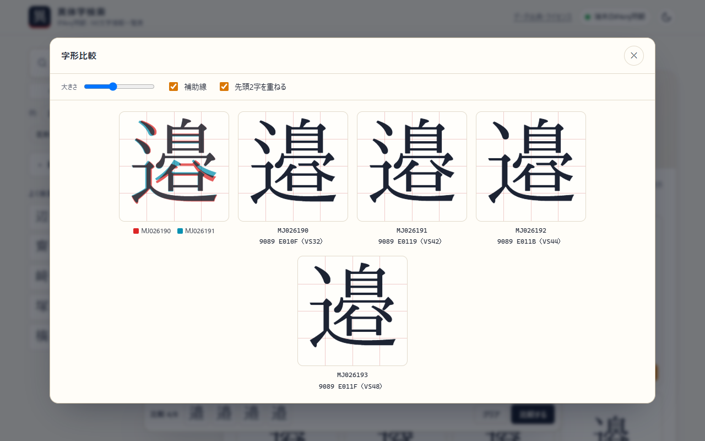

# MJ Variant Finder（IPAmj明朝 異体字・IVS 検索ツール）

**IPAmj明朝の異体字（IVS）58,843字形を、フォントをインストールしなくてもブラウザだけで検索・比較・ワンクリックコピー・高解像度PNG/SVG書き出しができるオープンソースの静的Webツールです。**  
サーバー処理も外部APIも一切不要で、静的ファイルを配置するだけで完全に動作します。

> 🌐 **オンラインデモ**: [https://photoguild-itteam.github.io/mj-variant-finder/](https://photoguild-itteam.github.io/mj-variant-finder/)  
> 📖 **徹底解説**: [異体字・IVS 完全活用ガイド（guide.html）](https://photoguild-itteam.github.io/mj-variant-finder/guide.html) ・ [English summary](#english-summary)



---

## 🎯 こんなお悩みを解決します（主な利用シーン）

- **Canva やデザインツールで異体字・旧字体が文字化けする**  
  文字コードとして貼り付けるとフォント非対応で「・」や「?」に化けてしまう環境でも、複数文字を連結した「高解像度透過PNG」または「SVGベクター」として一発書き出し。字形を崩さずデザインに配置できます。
- **戸籍・登記・公的文書・名簿の人名表記（渡辺・斎藤・山崎など）を正確に調べたい**  
  「辺・邉・邊」「斉・齊・斎・齋」「崎・﨑・嵜・㟢」などの複雑な異構字・異体字をコード（Unicode・IVS・戸籍統一文字番号・住基コード）とともに一覧表示し、どの字形を使うべきかを確実に特定できます。
- **漢字の通称や呼び名から直感的に検索したい**  
  「はしごだか」「たつさき」「つちよし」「ひのかつ」「つきぬけつの」「まゆはま」「やまかんむりのき」「きゅうじのさわ」「みつかね」などの俗称や、「やまへんのさき」「さかなへん」「ちからのこう」といった部首名＋読みから即座にヒットします。
- **形が酷似している漢字を見分けたい・誤字を防ぎたい**  
  果物の「柿（木＋市 5画）」と「こけら落とし」の「杮（木＋巿 4画縦貫通）」、「土」と「士（横棒長短）」、「日」と「曰（幅の差）」、「大」と「犬」と「太」、「奇」と「㟢（やまかんむりのさき）」、「荻」と「萩」など、混同されやすい漢字に注意喚起バナーと見分け方メモを表示します。

---

## ⚡ 主な機能と特徴

### 1. 直感的なマルチ検索

- **文字・単語検索**: 1文字だけでなく「渡辺」「中島」などの単語を入力すると自動で分解して各文字を展開。
- **読み検索**: ひらがなでの検索に対応。人名・地名の辞書を内蔵し、「さいとう」から「斉藤・斎藤・齊藤・齋藤」へ誘導。
- **俗称・呼び名検索**: 「はしごだか」「たつさき」「ひのかつ」「まるやなぎ」「きゅうじのさわ」「みつかね」「いってんしんにょうのへん」などの通称でダイレクトに字形を表示。
- **部首名＋読み検索**: 「やまへんのさき」「きへんのはし」「さかなへんのたい」などで直感的に絞り込み。
- **コード検索**: MJ文字図形名（`MJ026190`）、Unicode（`U+8FBB`）、IVS（`9089_E010F`）、HTML数値文字参照に対応。
- **手書き・画像認識検索**: キャンバスに描いた手書き文字（KanjiVG 6,702字）や、スクリーンショットの囲み画像から IPAmj明朝 全58,843字形を自動照合。

### 2. 混同しやすい字・異構字の相互リンク＆「並べて比較」

- 文字コードが異なる代表的異体字グループ（85グループ189字: `島・嶋・嶌`、`柳・栁`、`峰・峯`、`崎・﨑・嵜・㟢・碕`、`浜・濱・濵`、`塩・鹽`、`鉄・鐵` など）のリンクバーを配置。
- 「➕ 並べて比較」ボタンを押すだけで、グループ内の全文字を一括で比較トレイに投入可能。
- 類似字・誤認頻出字（土と士、天と夭、日と曰、大と犬と太、玉と王、柿と杮、奇と㟢、荻と萩、粟と栗、崇と祟など）の警告表示と見分け方メモを掲載。

### 3. 単語・苗字の「表記候補サジェスト」

- 「中島」で検索すると「中嶋」「中嶌」、「山崎」なら「山﨑」「山嵜」「山㟢」といった実在する別の異体字表記候補チップをヘッダーに自動提示し、ワンクリックで検索切り替え。

### 4. 高解像度 PNG / SVG ベクター書き出し

- 個別の字形だけでなく、複数文字（例: 「渡辺」「山﨑」）を連結した透明PNG（クリップボードコピー・ファイル保存、最大2048px）やSVGアウトラインとして一括書き出し可能。横書き・縦書きの両方に対応。

### 5. 差分の色分け表示・ゴシック体対応判定

- 通常の字形（IVSなし）と重ね合わせ、微小な骨格の違い・筆画の有無を赤青でハイライト。
- その異体字が一般的なゴシック体（Noto Sans JP / BIZ UDゴシック）で表示可能か（○/△/×）を一目で判定。

### 6. 検索履歴とお気に入り（完全ローカル完結）

- 直近の検索クエリを10件まで自動記憶。文字詳細から「お気に入り（ピン留め、最大20件）」に登録可能。ブラウザの `localStorage` で完結し、外部通信は一切行いません。

| 読み検索 | 字形の詳細 | 比較ビュー |
| :---: | :---: | :---: |
|  |  |  |

---

## 📊 他のツール・方法との比較表

| 項目・機能 | 通常の日本語IME | 公式 文字情報基盤検索 | MJ Variant Finder（本ツール） |
| :--- | :--- | :--- | :--- |
| **フォントインストール** | 必須（IPAmj明朝等） | 不要（画像表示のみ） | **完全不要（軽量Webフォント自動配信）** |
| **異体字のコピー** | IVS文字のみ（環境依存で化ける） | 不可（画像のみ） | **IVS・MJ番号・文字コード・透過PNG・SVG** |
| **複数文字連結書き出し** | 不可 | 不可 | **○（高解像度PNG・SVGアウトライン、縦/横）** |
| **Canva / デザインツール連携** | フォント非対応で化ける | 不可 | **○（画像・SVG貼り付けで100%崩れない）** |
| **俗称・通称検索** | 一部のみ | 不可 | **○（はしごだか、ひのかつ、やまき 等）** |
| **類似字・混同字の注意喚起** | 不可 | 不可 | **○（見分け方メモ・相互リンクバー）** |
| **手書き・スクショ画像検索** | 手書きのみ | 不可 | **○（手書き入力＋画像切り抜き認識）** |
| **字形の重ね合わせ・差分比較** | 不可 | 不可 | **○（赤青重ね合わせ＋違いの色表示）** |
| **サーバー通信・プライバシー** | 環境依存 | サーバー通信あり | **完全クライアントサイド（外部送信ゼロ）** |
| **ライセンス・費用** | OS依存 | 無料（公的検索） | **オープンソース（商用利用可・無料）** |

---

## ❓ よくある質問（FAQ）

### Q1. パソコンやスマートフォンにフォントをインストールしていなくても使えますか？

**A.** はい。本ツールは独自の軽量分割Webフォント（WOFF2）を必要な文字だけ自動読み込みするため、フォント未インストールの端末（Windows, Mac, iPhone, Android）でもすべての異体字・IVSが正確に表示されます。

### Q2. Canva や Illustrator、Photoshop で正しく文字を使うにはどうすればいいですか？

**A.** デザインツールが IVS（異体字セレクタ）に対応していない場合、テキスト貼り付けではなく、本ツールの「PNG保存（またはコピー）」や「SVG保存」をご利用ください。アウトライン化された画像・ベクターとして配置することで、環境を問わず100%意図通りの字形が保たれます。詳しくは [異体字・IVS 完全活用ガイド（guide.html）](https://photoguild-itteam.github.io/mj-variant-finder/guide.html#how-to-use-in-canva) をご覧ください。

### Q3. コピーした文字がメモ帳やメールで「・」や「?」に化けるのはなぜですか？

**A.** 貼り付け先のソフトウェアやOSが IVS に対応していないか、表示フォントに該当の字形が含まれていないためです。文字コードが失われたわけではありませんが、確実に字形を共有したい場合は画像・SVGでの書き出しを推奨します。

### Q4. 商用利用や社内イントラネットでの利用は可能ですか？

**A.** はい、可能です。プログラムは MIT ライセンス、文字データ・フォントは元のオープンライセンス（CC BY-SA 2.1 JP / IPAフォントライセンス等）に従っており、いずれも商用利用が認められています。社内Webサーバーや静的ホスティングにそのまま配置して利用できます。

### Q5. 検索した文字やアップロードした画像が外部サーバーに送信されることはありますか？

**A.** 一切ありません。本ツールは純粋なクライアントサイド静的Webアプリケーションであり、検索、手書き認識、画像照合、履歴保存のすべてが利用者のブラウザ内だけで処理されます。機密情報や個人名を含む業務でも安心してご利用いただけます。

---

## 📋 技術仕様・スペック

| 項目 | 内容・仕様 |
| :--- | :--- |
| **収録文字数** | 58,843字形（IPAmj明朝 Ver.006.01 準拠） |
| **対応規格・コード** | Unicode (UCS), IVS (Ideographic Variation Sequence / IVD 2022-09-13), JIS X 0213, 戸籍統一文字番号, 住民基本台帳ネットワーク統一文字コード, 入管外字コード |
| **エクスポート形式** | テキスト（IVS付きUnicode文字列）, MJ文字図形名, コードポイント表記, HTML数値文字参照, JavaScript/CSSエスケープ, 透過PNG画像（最大2048px、クリップボード対応）, ベクターSVG（アウトラインデータ） |
| **対応ブラウザ** | Google Chrome, Microsoft Edge, Safari, Mozilla Firefox（PCおよびスマートフォン各ブラウザに対応） |
| **動作要件** | 静的Webホスティング環境（Node.jsやPython等の実行サーバー不要、静的ファイル配信のみで動作） |
| **アクセシビリティ** | ダークモード・ライトモード対応、キーボードショートカット（`/` で検索欄フォーカス）、WAI-ARIA 準拠 |

---

## ⚠️ 免責事項

**本ツールは公的機関のデータを機械処理したものであり、字形の同一性・正確性を保証するものではありません。印刷や公的申請への利用は利用者の自己責任で行ってください。**

- 本プロジェクトは、MJ文字情報一覧表・IPAmj明朝の提供元（文字情報技術促進協議会・情報処理推進機構）とは**無関係の非公式のツール**です。
- 「異体字に置き換えた表記」（人名・地名の読み検索）は機械的に生成したもので、実在の確認はしていません。
- 手書き・画像からの認識は候補を提示するもので、結果の正しさは保証しません。
- 本ソフトウェアは MIT ライセンスのもと**現状のまま**提供され、サポート（SLA）はありません。**個別の文字の調査・解釈のご相談にはお応えできません。**
- 字形や文字コードが正しいかは、[公式の確認先](#公式の確認先)の検索システムで必ず確かめてください。

---

## 使い方

- 📖 **[異体字・IVS 完全活用ガイド](guide.html)**: IVS の仕組み、貼り付け先で文字化けする理由、Canva やデザインツール、Office で確実に異体字を扱うテクニックを詳しく解説した静的ガイドです。

### オンラインで使う

デモサイト（[https://photoguild-itteam.github.io/mj-variant-finder/](https://photoguild-itteam.github.io/mj-variant-finder/)）を開くだけです。検索クエリは URL の `#q=` に格納されるため、ブックマークやリンクによる共有が可能です。

### ローカル環境で動かす

```sh
git clone https://github.com/photoguild-ITteam/mj-variant-finder.git
cd mj-variant-finder
npm run serve            # = python -m http.server 8765 → http://127.0.0.1:8765/
```

ES Modules と fetch を使用するため、`file://` ではなくローカルHTTPサーバー経由で開いてください。ビルド済みのデータとフォントを含んでいるため、追加の環境構築は不要です（Python 3 があれば動きます）。

### 自社サイトや社内イントラネットに置く

リポジトリ直下の HTML（`index.html`・`guide.html`）と `src/` ディレクトリを、任意の静的ホスティング（GitHub Pages、Netlify、AWS S3、Apache、Nginx 等）に配置するだけです。**`LICENSE`・`LICENSES.md`・`licenses/` も一緒に配置してください**（画面からリンクしており、データのライセンス条件でもあります）。各 HTML の `og:url`・`og:image` や `guide.html` の `canonical` は、設置先の URL に合わせて書き換えてください。

---

## 開発

```sh
npm install              # 開発用（テスト・ビルド）。ツール実行には不要
npm test                 # 単体テスト（Node）+ データ検証（Python unittest）
npm run test:e2e         # ブラウザテスト（Playwright。要 Chrome、事前に npm run serve を起動）
```

- データやフォントの生成手順、各機能の設計思想は [docs/ARCHITECTURE.md](docs/ARCHITECTURE.md) をご覧ください。
- 俗称辞書（`src/data/nicknames.json`）や類似字辞書（`src/js/confusables.js`）へのデータ追加には、専用の支援スクリプト（`scripts/add_nickname.mjs`, `scripts/add_confusable.mjs`）を利用できます（詳細は [CONTRIBUTING.md](CONTRIBUTING.md)）。
- コントリビューションを歓迎します。セキュリティに関するご報告は [SECURITY.md](SECURITY.md) をご覧ください。

---

## ライセンス

このリポジトリは**複合ライセンス**です。プログラムは株式会社フォトギルドが作成したもので [MIT ライセンス](LICENSE) ですが、文字データとフォントは公的機関や外部プロジェクトの成果物を加工したもので、**元のライセンスをそれぞれ引き継いでいます。`src/data/`（`nicknames.json` を除く）・`src/fonts/`・`src/vendor/` は MIT ではありません。**

> ここに記載したのは各ライセンスの一般的な要約であり、法的な助言ではありません。利用形態に応じた条文原文の確認をお願いします。

### 各コンポーネントのライセンス

| 対象 | パス | ライセンス | 著作権者・出典 |
| :--- | :--- | :--- | :--- |
| プログラム・ドキュメント | `index.html`, `src/js/`, `src/css/`, `scripts/`, `tests/`, `*.md` | [MIT](LICENSE) | 株式会社フォトギルド |
| 異体字データ | `src/data/chars/`, `src/data/search-index.json`, `src/data/meta.json` | [CC BY-SA 2.1 JP](https://creativecommons.org/licenses/by-sa/2.1/jp/) ＋ [Unicode License v3](licenses/UNICODE-LICENSE.txt) | 文字情報技術促進協議会（MJ文字情報一覧表）、情報処理推進機構（MJ縮退マップ）、Unicode, Inc.（IVD・Unihan） |
| 手書き認識データ | `src/data/handwriting-patterns.json` | [CC BY-SA 3.0](https://creativecommons.org/licenses/by-sa/3.0/) | Ulrich Apel（[KanjiVG](https://kanjivg.tagaini.net/)） |
| 人名・地名辞書 | `src/data/names.json` | [ipadic ライセンス](licenses/IPADIC-COPYING.txt) | 奈良先端科学技術大学院大学（mecab-ipadic）、日本郵便（郵便番号データ） |
| 俗称・呼び名辞書 | `src/data/nicknames.json` | [MIT](LICENSE) | 株式会社フォトギルド |
| Webフォント | `src/fonts/` | [IPAフォントライセンス v1.0](src/fonts/LICENSE_IPA_Font_v1.0.txt) | 情報処理推進機構（IPAmj明朝）。派生フォント「MJ Variant Mincho」 |
| 画像検索データ | `src/data/image-index.*` | IPAフォントライセンス v1.0 | IPAmj明朝から算出した字形特徴量データ |
| 同梱ライブラリ | `src/vendor/` | [MIT](src/vendor/kanji-canvas.LICENSE.txt)・[Apache-2.0 ほか](src/vendor/THIRD_PARTY_LICENSES.txt) | Kanji Canvas、fontkit と依存パッケージ |

詳細なファイル対応は [LICENSES.md](LICENSES.md) をご確認ください。商用利用を含め、各ライセンスの利用条件を満たしていれば自由に活用いただけます。

---

## 出典

- [MJ文字情報一覧表](https://moji.or.jp/mojikiban/mjlist/)・[IPAmj明朝](https://moji.or.jp/mojikiban/font/)（文字情報技術促進協議会）、[MJ縮退マップ](https://moji.or.jp/mojikiban/map/)（情報処理推進機構）
- [Unicode IVD](https://www.unicode.org/ivd/)・[Unihan](https://www.unicode.org/reports/tr38/)（Unicode, Inc.）
- [KanjiVG](https://kanjivg.tagaini.net/)（Copyright (C) 2009-2013 Ulrich Apel、CC BY-SA 3.0）・[Kanji Canvas](https://github.com/asdfjkl/kanjicanvas)（手書き認識）
- [mecab-ipadic](https://taku910.github.io/mecab/)・[郵便番号データ](https://www.post.japanpost.jp/zipcode/dl/utf-zip.html)（人名・地名の読み）

---

## 公式の確認先

字形や文字コードが正しいかは、公的機関やデータ提供元が公開している公式システムでご確認ください。

- [戸籍統一文字情報](https://houmukyoku.moj.go.jp/KOSEKIMOJIDB/M01.html)（法務省）: 戸籍で使われる文字を、読み・画数・部首・コード・戸籍統一文字番号で検索できます。
- [文字情報基盤検索システム](https://moji.or.jp/mojikibansearch/basic)（文字情報技術促進協議会）: MJ文字情報一覧表の正式な字形を検索できます。

---

## English summary

**MJ Variant Finder** is a zero-dependency static web application for searching, comparing, copying, and exporting 58,843 Japanese kanji variant glyphs (Ideographic Variation Sequences, IVS) based on the **IPAmj Mincho** font, entirely in the browser without any font installation, backend server, or external API.

### Key Capabilities

- **Multi-modal Search**: Search by character, word, reading (hiragana with Japanese names/places dictionary), glyph nicknames (`はしごだか`, `たつさき`, `ひのかつ`, `まゆはま`), radical + reading (`やまへんのさき`), MJ glyph identifier (`MJ026190`), Unicode (`U+8FBB`), or IVS code (`9089_E010F`). Also supports canvas handwriting recognition and screenshot image matching against all 58,843 IPAmj Mincho glyphs.
- **Confusable & Variant Cross-links**: Bidirectional links between 85 groups (189 characters) of code-separated variants (`島/嶋/嶌`, `柳/栁`, `崎/﨑/嵜/㟢/碕`, `塩/鹽`, `鉄/鐵`) with a "Compare all" one-click button. Warning alerts and stroke distinction notes for confusable pairs (`土` vs `士`, `日` vs `曰`, `柿` vs `杮`, `奇` vs `㟢`, `荻` vs `萩`).
- **Word Variant Suggestions**: Auto-suggests existing variant notations for multi-character queries (e.g., searching "中島" suggests "中嶋" and "中嶌").
- **Export for Design Tools (Canva, Photoshop, etc.)**: Export single or multi-character sequences as transparent PNGs (up to 2048px, clipboard-ready) or SVG vector outlines (horizontal & vertical). Prevents font fallback and glyph corruption in IVS-unsupported applications.
- **Diff & Comparison**: Visual overlay highlighting fine stroke differences between IVS variants and standard glyphs. Side-by-side and red/blue overlay comparison modes.
- **Gothic Font Availability**: Instant indicator (○/△/×) of whether a variant glyph is available in standard Japanese Gothic fonts (Noto Sans JP / BIZ UD Gothic).
- **Privacy & Security**: Pure client-side execution; all searches, handwriting inputs, screenshots, and search histories stay inside the browser (`localStorage`). Zero telemetry, zero external network traffic.

Online Demo: [https://photoguild-itteam.github.io/mj-variant-finder/](https://photoguild-itteam.github.io/mj-variant-finder/)  
Usage Guide: [guide.html](https://photoguild-itteam.github.io/mj-variant-finder/guide.html)

---

## クレジット

Developed by **株式会社フォトギルド (PHOTO GUILD Inc.)** — [https://photoguild.jp](https://photoguild.jp)
